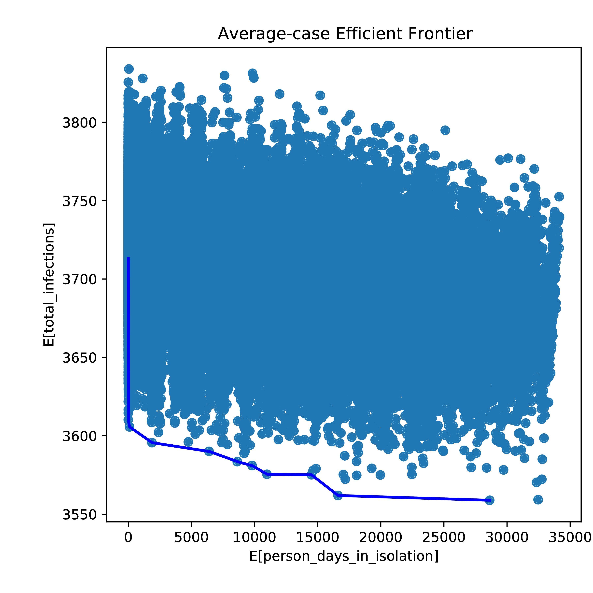
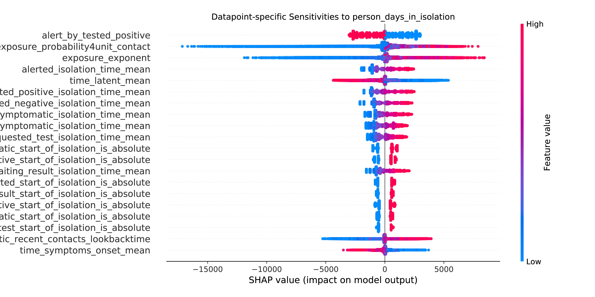
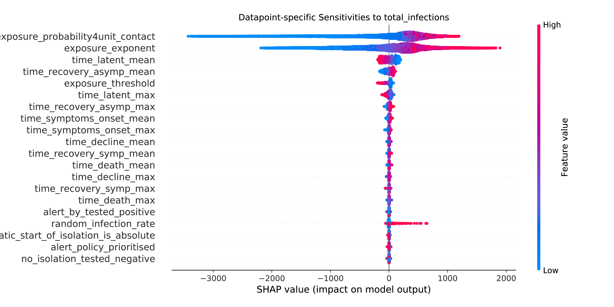

# How the Efficient Frontier is Computed and How to Read the Policy Recommendations

By running `src/policy_frontier.py` we obtain an efficient frontier between two focused metrics,
which by default are the total number of days in isolation and the total number of deaths.
Each dot in `${prefix}.tradeoffs.pdf` corresponds to the vector of all policy parameters,
and the x-axis and y-axis scores for this vector is computed by many samples of random disease parameters.

This document first provides how these metrics are computed, whose understanding is
essential for meaningful recommendation of policies. Then we discuss how to read the resulting CSV files
`${prefix}.average_case_policies.csv` and `${prefix}.worst_case_policies.csv`.

## Definition of the Frontiers

Remember that the final loss metric such as the total number of deaths
is determined by population, disease, and policy parameters. The government can control
the parameters of isolation and tracing policies while cannot control the population and disease parameters.
In this document, the controllable parameters are called 'policy parameters',
and the uncontrollable ones are called 'environment parameters'.

We denote the space of feasible policy parameters by
.
Then let 

and 

be random variables of the policy and environment parameters, respectively.
The sum of two dimensionalities equals to the number of all parameters in Contact Tracing Model,
i.e., .
Then let 
and 

be random variables of the focused output metrics, such as the total isolation days and deaths. 
There exist two functions 

such that
 and

where
 and 
 are
zero-mean random noise variables.

Let 
be the distribution of environment parameters, in order to represent the uncertainty of environment.
If we have some real data to estimate the environment parameters, 
 is the posterior
conditional on that data. Otherwise we use some prior as 
.

Then our interest is to find out some policy parameters that work robustly well in many different
environments that can exist, i.e., we are interested in the optimisation of policies under uncertainty.
We do not have to think about the policies for non-existent environments. If some environmental parameters
are uncertain, however, the chosen policy must work well in those possible situations. 

Let us first focus on the average case. We are interested
in functions  
such that 
and .
For many metrics of our interest, we expect that there is some trade-off between the minimisation of 
 and that of 
. Hence we want

  for a specified constant . 

For a given  there is no rationality
to choose policy parameters other than 
 though
this optimum is not guaranteed to be unique.
By gradually changing the value of ,
we should have a set of *optimal* policy parameters that we call the average-case efficient frontier.

Then let us also think of the worst case. Because the true worst case of a continuous random variable
can become infinite, we instead consider some upper percentile, say 99%-tile that corresponds to
Value at Risk (VaR) in finance. We can also think of Conditional Value at Risk, which is the expectation
when exceeding the VaR but we discuss VaR for simplicity.
Let 

be the 99%-tile operator under distribution .
Then the statistics of our interest are
 
such that 
 and
. Then we can think of the trade-off 
between the minimisation of 
and that of  in the same manner
as the average case. We call the resulting trade-off as the worst-case efficient frontier.

## Empirical Approximation

Now we have definitions of the average-case and worse-case policy frontiers that exist
under the true functions 
and the true distributions of environmental parameters.
In reality, what we can have are only a finite number of samples to approximate the true value.
Here we discuss how to empirically approximate the frontiers.

**Empirical Mean or Percentile of the Metrics** 

We first assume that by certain machine learning algorithms we have a good estimate of 

as .
By calling `src/draw_parameters` we already have
 random samples
 and
 as
. Then for each policy-parameter sample , we compute the empirical mean as

 and
. 

We can also compute the empirical 99%-tiles 
 and
.
Here we are computing the average or quantile across many environmental parameters
but with fixed policy parameters. We just reuse the existing samples without the burden of another random generation.

We compute the empirical statistics for all policy parameter samples , and the total computational cost is quadratic to the sample size . When the sample size is large, e.g., 10^3">, this quadratic cost is too expensive and we squash the samples of environmental parameters. Let
 be randomly chosen 
indices. Then

 and
. 

We think 
 provides a sufficient accuracy and hence
the total computational cost becomes linear to the sample size as .

**Empirical Metrics and their Frontier** 

Scatter plot of the empirical statistics

clarifies how much scores can be achieved when we adopt the policies only on the frontier.
By sorting the score values of x-axis, we compute the path of piecewise-linear empirical frontier as the following figure example.

Our ultimate interest is which settings of the policy parameters are on the line of the efficient frontier.
Because each point in the scatter plot corresponds to one vector of policy parameters,
we can see the substance of the policy parameters
as each row in the `${prefix}.average_case_policies.csv` and `${prefix}.worst_case_policies.csv` files.
You can see an [average-case example](../example_result/sample_covid_model/frontier.average_case_policies.csv)
and a [worst-case one](../example_result/sample_covid_model/frontier.average_case_policies.csv).

Finally let us note that some policy parameters, which are not so influential to the output metrics,
tend to be at random because of their unimportance. Hence the choice of policy parameters should be
done with consideration of their importance, which are available by sensitivity analysis plots. In the next example,
we can see that a binary parameter `alert_by_tested_positive` and integer parameters `*_isolation_time_mean` are strongly influential to the total number of days in isolation. We should carefully watch the corresponding columns of
the policy CSV files, while values in the other columns tend to be noises and we should not read too much
from the actual values of the unimportant parameters.

In order to understand the importance of each policy parameter, we should watch the sensitivities to both x-axis and y-axis metrics. The total number of infections is strongly driven by exposure-related disease parameters and hence many policy parameters are less influential. Unless having more reliable priors on the disease parameters, impact of policy parameter choice to the total number of infections is masked by much stronger influence of disease parameters.

